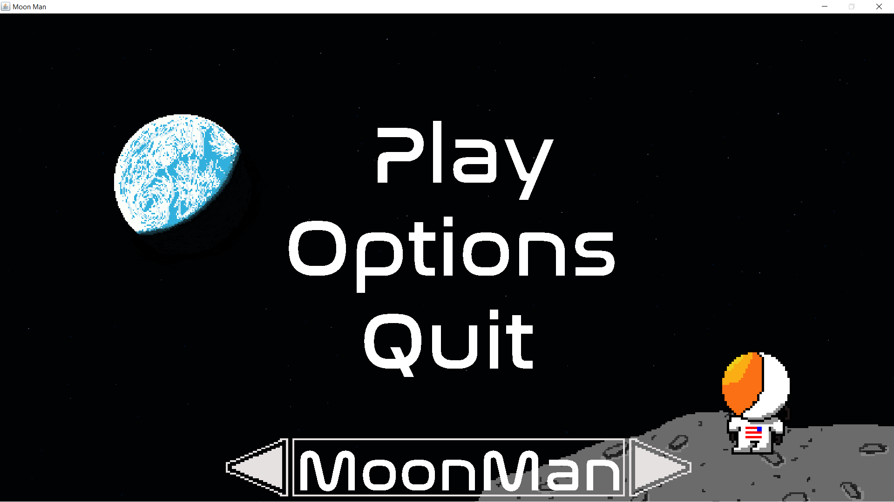

# MoonMan
**Team Name:** Satellite Gaming

**Team members:**
- Dylan Lee
- Antonio Vega
- Julian Ball
- Zach McMichael
- Adam Tutko

## Introduction
  The project will be a 2-D side-scrolling video game in which waves of enemies will attack the player. The goal will be survival and eliminating enemies to achieve a high sccore. The motivation behind the project is to apply the group’s current programming abilities to build a custom game. A substantial motivating factor behind this was the desire to create something unique and custom that is also based on the personal interests of each group member. The game will be implemented in Java to further the group members experience in a new programming language. This language will also allow for a smoother implementation of the project by utilizing the robust libraries already in existence. The project, while unique, is not a new concept. It will visually resemble some critically acclaimed games such as Mario while encompassing the battle style of Super Smash Bros. This will allow for a robust combat system while still allowing the vision to be implemented accurately.

The largest motivating factor behind the decision to build a game was the creative freedom and graphical aspect of game programming. Throughout all of the group members' Computer Science educations, the most aesthetically pleasing part of any program may have been some basic ASCII art. Pair this with the fact that these program have been limited in some way or another, whether it be a set input, or perfectly formatted output, the creative liberty is usually restricted to help drive a specific learning outcome. This made the idea of turing code into graphically complex, animated output, very appealing. Developing a game also gives full creative freedom to all group members, where the only limiting factor is programming ability. On top of all this, group members finally have full implementation freedom in game development. No specific algorithm or strategy must be followed, but rather the exsisting programming knowledge must be used to solve a problem. It was this combination of creative freedom and real world application of programming abilites that lead to the group choosing to design a game.

While this game will be a side-scroller it will not be designed as a platformer; instead, it will consist of one endless level in which waves of enemies attack the player. The player will have a selection of different weapons to combat the enemies, ranging from close range melee weapons to long-range projectile weapons. As the player makes further progress in the game by eliminating enemies, the option to upgrade their character and weapons will be provided. As the player progresses, the enemies will also increase in strength and number. This will allow for a simple way of increasing difficulty, without having to implement more features. The game will have a space theme, where the main character will be a spaceman in a moon suit similar to the ones used when landing on the moon. The enemies will be a multitude of different aliens designed with many different styles and combat abilites.

There have been no major changes to the design or development cycle. The only major change has been eliminating some of the additional features that we planned to implement after building our base game. We had planned to add additional enemies and weapons while enhancing the small things such as character interactions and loading screens in between levels. We are slightly disappointed in not being able to implement these features but we are very satisfied with our base game. 

Other than these additional features that were left out, we were succesful in making our game. We met mostly all of the goals we had at the start of this semester. Overall the team really enjoyed creating this game and felt that is was a succesful project. We hope to continue work on the game over the summer and implement the rest of the features left out due to time constraints. 

## Customer Value
  No changes.

## Solution and Technology
   The further into the development we got, the more we became comfortable with the overall layout and structure we planned during the beginning stages. Small tweaks were made to some base classes to help with things such as enemy hitbox detection, level scrolling, and player movement. We feel that classes such as the handler class, which ticks and renders any game object, have been extremely helpful in our development to allow one layer of abstraction when implementing things such as the lazer shooting and enemy AI. This structure, that was layed out in the original proposal, will continue to be useful moving forward, especially as we add more enemies and features.  
   Throughout the project we have taken pride in creating any and all needed features of our game from scratch, without using any predefined game libraries. We handle all player and enemy hitbox detection using the Java rectangle class and have done all animations manually using sprite sheets and the Java BufferedImage class. One of the more difficult parts of starting from scratch is figuring out solutions and what logic to use when implementing new features. It is up to the team to brainstorm on possible solutions and try to choose what we feel to be the best option. While this has definielty proven challenging it has helped to improve all team members programming and problem solving abilites.
   Throughout the first iteration our goal was to create a base game that the team was happy with. This meant creating all the needed framework and foundational pieces so that we can focus our final efforts on features and tweaks. We feel as though we are extremely close to meeting this goal and are just a few issues away. Below are some screen shots showing our progress so far. All artwork credit goes to team member Zach McMichael and was hand drawn.
   
   
   
   
   One great part of developing a game is that the testing is rather painless. While we may have sometimes been disappointed our implementations failed, testing has been rather enjoyable. That being said, we have tested our game extensivley, trying everything possible to find bugs. This has resulted in quite a few changes to our implementations for player movement and creating a side-scrolling level. 
   After finishing our minimum viable product, we intended to begin customizing the game to make it more interesting. Thus, we planned on adding multiple characters to choose from and different enemies to face. This would be fairly easy to implement as the base fraework for facing and defeating enemies has already been implemented. Alongside this, we want to add a more robust scoring system and a way to make the game more challenging. While we have made minor attempts at increasing the difficulty as the player progresses, the game certainly does not meet our standards. We will need to continue testing to figure out a good way of implementing the difficulty system.

## Project Management 
  We completed a product we are satisfied with within the schedule, however we did not end up implementing everything we had hoped. We had to cut a good portion of what we had planned due to time constraints. As such, the game lacks extra content that would make the game more interesting and fun. We ended spending a good deal of time on bug fixes near the end of the semester. Because of this we were unable to dedicate as much time as we would have liked to other parts of the game.
  
  **Time Line:**
  
  | Date Issued | Date for Completion | Task |
  | :---: | :---: | --- |
  | ~~2/4/19~~ | ~~2/18/19~~ | ~~Build the game foundation and framework, main game loop, rendering, resource loading(sprites, music, sound effects), core object creation, object controller, key and mouse input detection.~~ |
  | ~~2/18/19~~ | ~~2/25/19~~ | ~~Character and level design, sprite sheet creation, menu implementaion, character and enemy motion, collision detection, camera creation.~~ |
  | ~~2/25/19~~ | ~~3/4/19~~ | Weapon design and implementaion, ~~further motion tweaking and base enemy AI,~~ creating multiple enemies(strong/weak). |
  | ~~3/4/19~~ | ~~3/11/19~~ | ~~Hitbox detection for weapons, player and enemy health, scoring system~~ and saving game data to file. |
  | ~~3/11/19~~ | ~~3/18/19~~ | ~~Player customization,~~ weapon upgrades, ~~creating multiple levels/waves of enemies.~~ |
  | ~~3/18/19~~ | ~~3/25/19~~ | Further player and weapon customization, ~~adding different playable characters with unique attributes.~~ |
  | ~~3/25/19~~ | ~~4/1/19~~ | ~~Beta testing and further motion/game mechanics tweaks as needed.~~ |
  | ~~4/1/19~~ | ~~4/8/19~~ | ~~Bug fixes/gameplay tweaks,~~ adding between level mini-games(meteor showers, etc). |
  | ~~4/8/19~~ | ~~4/15/19~~ | ~~Final testing and small last minute modifications.~~ |
  | ~~4/15/19~~ | ~~4/22/19~~ | ~~Project completion~~/game release. |
    

## Team
**Description**

The teams experience in other programming languages has been vital in team members learning and becoming proficient in Java. This was expected when we began this project and we knew that even though no one had a lot of experience in Java, our experience in other programming languages would be very helpful. All team members now feel comfortable working in Java and are able to implement features of the game without much issue. All of the team members served an important role in implementation of game features as well as bug fixes. For the next iteration roles will continue as planned since it has worked quite well for the first iteration.

**Individual Background/Contributions:** 
- **Dylan Lee:** Dylan is a undergraduate student in his junior year, majoring in Computer Science. His experience includes 2.5 years of programming in C and C++, as well as some simple C++ game development in his free time. Although he is not well versed in Java, his expereince will allow an easy transition to the new language.   
  - **Contribution/Implementation**  Dylan contributions have included the base game framework such as the main game class holding the game loop and constructors, the handler class, game object class, and some of the player movement and floor collision detection. For the next iteration Dylan will be working on switching levels, enemy and player health, and enemy spawing.  
- **Antonio Vega:** Antonio is from a small town called McKenzie located in West Tennessee. He is a junior undergraduate majoring in Computer Science. Prior to attending undergraduate studies, he had no experience programming whatsoever. Skills include: programming in C/C++, Photoshop and Lightroom. Currently learning about systems programming, automata, and operting systems.
  - **Contribution/Implementation** So far, Antonio has helped in implementing/creating the mouse input class, menu and options screens, and sound files. The mouse input class was built using Java's libraries such as MouseAdapter and MouseEvent. This class helps detect and track mouse input from the user. As far as what the user/player uses the mouse in the game, it helps with navigation of the game using appropiate boxes for certain options in the menus. Once the player is in the game itself, the mouse is mapped to actions such as click to shoot, as well as aiming with the cursor. For the menu and options screens, Antonio implemented the options menu that the player can access from the either the menu or pause menu (As of now, the options sub-menu has only been implemented for the main menu splash screen when the game is initially executated.). These options include sound levels, difficulty, and tutorial options that the user can toggle to his or her desire. As for the sound file playback, it was created using Java's built in libraries, such as Clip, AudioInputStream, and AudioSystem. With this implementation, all audio files are .wav files as this is the format that the libraries support. Sound playback is used to throughout the whole game, from navigation to playing the game itself, sounds such as when the player jumps, shoots, kills enemy, and background music. 
- **Julian Ball:** Julian started programming his freshman year and has learned about C/C++, vim, Python and is currently learning about shell scripts. he has recently been doing research that requires basic knowledge of machine learning concepts and would like to continue learning about artificial intelligence. Julian also is very interested in game development and is excited to be a part of this project.
  - **Contribution/Implementation** Julian made the Laser class and the shooting mechanics as well as walking mechanics. He also provided feedback to his other team members on their contributions. He has fixed various walking and flying bugs that have come up throughout the game's development. He has had a lot of involvment in the KeyInput class and how MoonMan moves in the level.
- **Zach McMichael:** Zach is an undergraduate student who is proficient in C and C++. He has been in the process of learning Java and Python on his own time to further is knowlege of programing. He will be heading up using Piskell to create and manifest all of the characters, animations, and backgrounds for the project this semester. 
  - **Contribution/Implementation** Zach was a key factor in the implementing and fixing of the side scrolling level when the player is moving, which proved to be the biggest issue we faced regarding bugs. He is also the sole artist for the project and has hand drawn every character, the background, and the foreground. On top of all this, he has been the psuedo project manager. This has included the creation and assigning of issues and steering the team towards implementing essential parts of the game.
- **Adam Tutko:** Adam is an undergraduate in pursuit of his Bachelor in Computer Science. He has 2 and a half years of experience programming in C++/C and has a firm grasp on HTML and CSS as well as some experience in Python. Though he lacks any prior experience with Java, his solid programming foundation will lend itself to a quick and solid understanding of the language.
  - **Contribution/Implementation** Adam implemented the flight mechanism associated with the character MoonMan. This includes jetpack regeneration, floating of the character, timed flight, and the ability to move in all cardinal directions when in filght. He has also contributed to big fixes with walking, jumping, and the animations of the Alien and Character MoonMan.
  
## Reflection

  Overall we have really enjoyed developing the game and feel very satisfied with the progress we have made. We have not had to deviate from our original plan at all and we are very happy that we have not gotten stuck on any issues.
  The beginning development went well and we made a lot of progress without many major bugs. All of the animations and graphics turned out great and have progressed smoothly. Thankfully much more has gone well than what has gone bad.
  The only things that have not gone smoothly involve the more complex implementation of level scrolling and detection of the player near the edge of the screen.
  Initially, our planning was on point, we knew each other well prior to this class and project. Because of this, we were able to communicate, organize, and plan from the beginning which gave us a lot of time to focus on the project itself.
  As a result, we started development as soon as we had everything planned out. Developing as a team went great, we kept each other in check and made sure each member had fulfilled the job they were given. 
  Due to the structure of our project, testing the game was performed as development went along. Incrementally testing and developing ensured that no major bugs or hurdles prevented us from delivering a working, simple game.
  Overall, our team management was excellent thanks to our project manager Zach McMichael. Zach kept the team on track and pushed us to meet our goals and requirements. As a team, we functioned and coordinated well with each other. Most of the development was done by each individual in their own time, but any time we needed to meet and develop a part of the game or fix a bug, we would make great progress. 
  
  **Conclusion:**
  
  Do we consider this project a success? Yes and no. Yes in terms of that we met the minimum requirements for this class and what we sought out to learn and gain experience from this. As a group, we learned how to code in Java, and how to build/work on a project using version control(Github) and working together as a team. No in terms of what we envisioned the final product to be, implementing a more dynamic game with customization and progressiveness in the game. Not that we were incapable of such a product, we were simply limited in the time we had for this project. 
